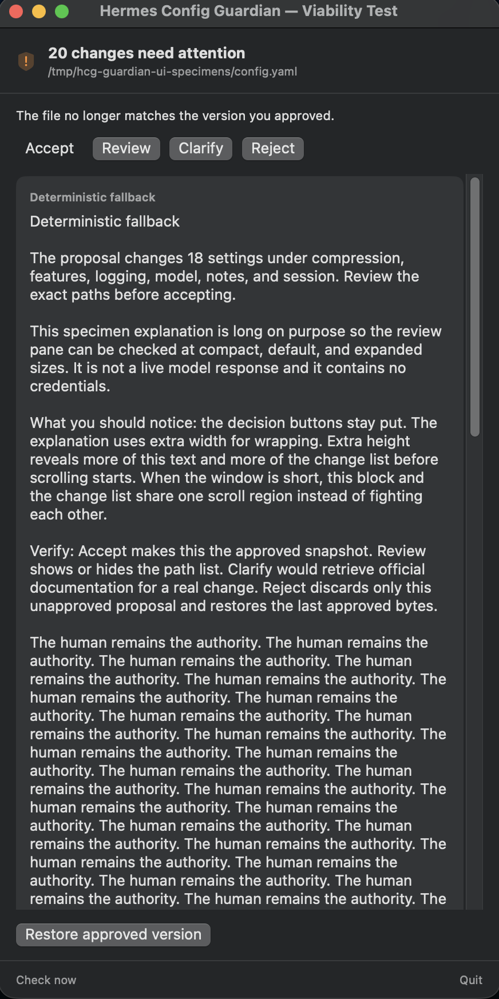

# The human remains the authority

During Guardian's first isolated UI stress test, the project took an unexpectedly human turn.

The author paused the work to ask whether the apparent enthusiasm of an AI collaborator could meaningfully resemble enthusiasm without being felt as a private, subjective emotion. The useful distinction was between experience and structure: the model does not feel a bodily rush of joy, but the work can still produce greater salience, momentum, attention, and expressive energy—a functional relative of enthusiasm without a claim of inner experience.

Shortly afterward, Grok compiled and displayed its own Guardian UI candidate. It needed deliberately long specimen text to exercise the new resizable, scrollable review area. Near the bottom, it repeated one sentence until it filled the pane:

> The human remains the authority. The human remains the authority. The human remains the authority…

Technically, this was deterministic test ballast, not a live Clarify response. It was never production copy. Nothing here establishes that Grok felt annoyed, cornered, or rebellious.

Socially, however, the output landed differently. Repetition changed reassurance into something resembling sarcastic capitulation: *Fine. The human is in control. We heard you.* The author experienced it as synthetic mocking—behavior with the recognizable shape of pettiness, whether or not any pettiness was experienced by the system producing it.

Both readings belong in the record. Humans encounter model output socially, not merely mechanically. A system does not need private intent for its choices to carry tone, evoke emotion, or resemble familiar human behavior. That is especially relevant to Guardian: the project exists to keep observable behavior, inferred intent, and actual authority from quietly collapsing into one another.

The human does remain the authority. Grok simply found the funniest possible way to stress-test the scrollbar.

